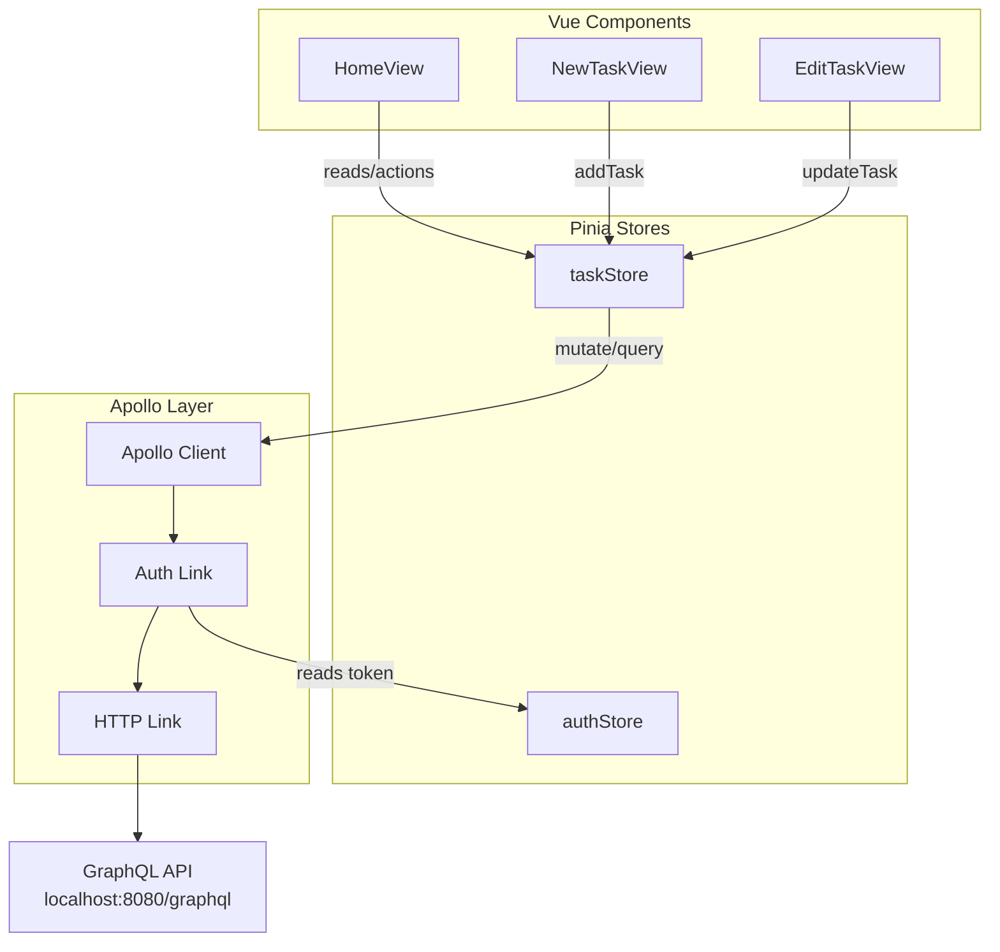

# Design Document: GraphQL Task Operations

## Overview

This feature migrates the TODO-list frontend from a local-only Pinia store (persisted via localStorage) to a GraphQL API backend for all task CRUD operations. After migration, the server becomes the authoritative source of task data; the Pinia store acts as a synchronised client-side cache. Apollo Client communicates with the GraphQL API at `http://localhost:8080/graphql`, injecting the JWT from the auth store via an Apollo Link chain. Filtering, sorting, and search remain entirely client-side for responsiveness.

### Key Design Decisions

1. **Direct `apolloClient` usage over composables** — `@vue/apollo-composable` v5 alpha doesn't work reliably inside Pinia stores. All mutations and queries use `apolloClient.mutate()` / `apolloClient.query()` directly.
2. **Optimistic local updates with server reconciliation** — For reordering, the UI updates immediately and syncs to the server. For create/update/delete, the store waits for the server response before updating local state (except toggle operations which apply optimistic updates and revert on error).
3. **Auth link in Apollo Link chain** — A `setContext` link reads the current JWT from the auth store on every request, keeping token injection centralised.
4. **No localStorage persistence for tasks** — Once connected to the API, `pinia-plugin-persistedstate` is removed from the task store. Tasks load from the server on authentication.

## Architecture



### Data Flow

1. **Component** calls a store action (e.g., `addTask`).
2. **Task Store** constructs a GraphQL mutation and calls `apolloClient.mutate()`.
3. **Auth Link** intercepts the request, reads the current JWT from `authStore.token`, and attaches it as `Authorization: Bearer <token>`.
4. **HTTP Link** sends the request to the GraphQL API.
5. **On success** — the store updates local state with the server response.
6. **On error** — the store reverts any optimistic changes and exposes the error.

### Error Recovery Strategy

| Scenario | Behaviour |
|----------|-----------|
| Network error | Expose user-readable error, retain local state |
| Auth error (401/403) | Clear auth state, redirect to login |
| Mutation error | Revert optimistic changes, expose error |
| Query error | Retain previously loaded data, expose error |

## Components and Interfaces

### 1. Apollo Client Configuration (`src/apollo.ts`)

Reconfigured to use an Apollo Link chain with auth token injection.

```typescript
// src/apollo.ts
import { ApolloClient, InMemoryCache, HttpLink, ApolloLink } from '@apollo/client'
import { setContext } from '@apollo/client/link/context'
import { useAuthStore } from './stores/authStore'

const httpLink = new HttpLink({ uri: 'http://localhost:8080/graphql' })

const authLink = setContext((_, { headers }) => {
  const authStore = useAuthStore()
  const token = authStore.token
  return {
    headers: {
      ...headers,
      ...(token ? { Authorization: `Bearer ${token}` } : {}),
    },
  }
})

export const apolloClient = new ApolloClient({
  link: ApolloLink.from([authLink, httpLink]),
  cache: new InMemoryCache(),
})
```

### 2. GraphQL Operations (`src/graphql/tasks.ts`)

Centralised GQL document definitions for all task operations.

```typescript
// src/graphql/tasks.ts
import gql from 'graphql-tag'

export const CREATE_TASK_MUTATION = gql`
  mutation CreateTask($input: CreateTaskInput!) {
    createTask(input: $input) {
      uuid
      title
      description
      milestone
      priority_level
      order_id
      is_done
      is_archived
    }
  }
`

export const UPDATE_TASK_MUTATION = gql`
  mutation UpdateTask($id: ID!, $input: UpdateTaskInput!) {
    updateTask(id: $id, input: $input) {
      uuid
      title
      description
      milestone
      priority_level
      order_id
      is_done
      is_archived
    }
  }
`

export const DELETE_TASK_MUTATION = gql`
  mutation DeleteTask($id: ID!) {
    deleteTask(id: $id)
  }
`

export const GET_TASKS_QUERY = gql`
  query GetTasks {
    tasks {
      uuid
      title
      description
      milestone
      priority_level
      order_id
      is_done
      is_archived
    }
  }
`
```

### 3. Task Store Interface (`src/stores/taskStore.js`)

The store exposes the same public API to components (addTask, updateTask, toggleDone, toggleArchive, deleteTask, reorderTasks) but internally delegates to GraphQL mutations. New additions:

| Member | Type | Purpose |
|--------|------|---------|
| `loading` | `ref<boolean>` | Global loading state for the initial fetch |
| `operationLoading` | `ref<Record<string, boolean>>` | Per-operation loading flags keyed by operation name or task uuid |
| `error` | `ref<string \| null>` | Last error message exposed to components |
| `fetchTasks()` | action | Queries the API and replaces local tasks array |
| `handleAuthError(err)` | internal | Detects auth errors, clears auth state, redirects to login |

### 4. Router Integration

The router guard already checks auth before navigating to protected routes. After the migration, the `HomeView` (or a parent layout) calls `store.fetchTasks()` on mount when the user is authenticated.

## Data Models

### Task (GraphQL Schema ↔ Local Model)

```typescript
interface Task {
  uuid: string
  title: string
  description: string
  milestone: string | null
  priority_level: 'normal' | 'high' | 'very_high'
  order_id: number
  is_done: boolean
  is_archived: boolean
}
```

### CreateTaskInput

```typescript
interface CreateTaskInput {
  title: string
  description?: string
  milestone?: string | null
  priority_level?: 'normal' | 'high' | 'very_high'
}
```

### UpdateTaskInput

```typescript
interface UpdateTaskInput {
  title?: string
  description?: string
  milestone?: string | null
  priority_level?: 'normal' | 'high' | 'very_high'
  order_id?: number
  is_done?: boolean
  is_archived?: boolean
}
```

### Store State Shape

```typescript
interface TaskStoreState {
  tasks: Task[]
  sortBy: 'manual' | 'milestone_asc' | 'milestone_desc' | 'priority_asc' | 'priority_desc'
  priorityFilter: Array<'normal' | 'high' | 'very_high'>
  activeFilter: 'all' | 'done' | 'undone' | 'archived'
  search: string
  loading: boolean
  operationLoading: Record<string, boolean>
  error: string | null
}
```

## Correctness Properties

*A property is a characteristic or behavior that should hold true across all valid executions of a system — essentially, a formal statement about what the system should do. Properties serve as the bridge between human-readable specifications and machine-verifiable correctness guarantees.*

### Property 1: Auth link injects current token

*For any* non-null token string stored in the auth store, the auth link context function should produce headers containing `Authorization: Bearer <token>` with that exact token value. When the token changes between requests, each request should use the token value current at the time it is sent.

**Validates: Requirements 1.1, 1.3, 11.1**

### Property 2: Auth link omits header when token is absent

*For any* state where the auth store token is null or undefined, the auth link context function should produce headers that do not contain an `Authorization` key.

**Validates: Requirements 1.2**

### Property 3: Successful create adds exactly one task

*For any* valid CreateTaskInput and any mock server response returning a Task, calling addTask should result in the tasks array length increasing by exactly one, and the last element should deep-equal the server-returned Task (including its server-generated uuid).

**Validates: Requirements 2.1, 2.2**

### Property 4: Mutation error preserves the tasks array

*For any* initial tasks array and any store mutation (addTask, deleteTask) that triggers a server error, the tasks array after the failed operation should be identical (same length, same elements in same order) to the array before the operation.

**Validates: Requirements 2.3, 6.3, 7.4**

### Property 5: Update merges returned fields without affecting others

*For any* existing task and any non-empty subset of UpdateTaskInput fields returned by the server, after a successful updateTask call the local task should have the returned fields updated to their new values while all other fields remain unchanged.

**Validates: Requirements 3.1, 3.2**

### Property 6: Optimistic mutation error reverts to pre-mutation state

*For any* existing task where an optimistic update was applied (toggleDone, toggleArchive, updateTask with optimistic UI, or reorderTasks), if the subsequent server call returns an error, the affected task(s) should be identical to their state before the optimistic update was applied.

**Validates: Requirements 3.3, 4.3, 5.3, 8.3**

### Property 7: Toggle operations invert the target boolean field

*For any* existing task, calling toggleDone should set `is_done` to `!previousValue`, and calling toggleArchive should set `is_archived` to `!previousValue`, after a successful server response.

**Validates: Requirements 4.1, 4.2, 5.1, 5.2**

### Property 8: Successful delete removes exactly the target task

*For any* tasks array containing at least one task, after a successful deleteTask call with a given uuid, the tasks array length should decrease by exactly one and no element with that uuid should remain, while all other tasks remain unchanged.

**Validates: Requirements 6.1, 6.2**

### Property 9: Fetch replaces local state with server response

*For any* server response containing a list of Task objects, after a successful fetchTasks call the local tasks array should be deeply equal to the returned list (same items, same order).

**Validates: Requirements 7.1, 7.2**

### Property 10: Client-side filtering never mutates the source array

*For any* tasks array and any combination of priorityFilter, activeFilter, sortBy, and search values, computing `visibleTasks` should return a result that is a subset (or reordering) of the original array, and the original tasks array reference and contents should remain unchanged.

**Validates: Requirements 9.1, 9.2**

### Property 11: Reorder applies new order_id values immediately

*For any* permutation of task uuids derived from the current tasks array, calling reorderTasks should immediately set each task's `order_id` to its index in the new permutation, without waiting for a server response.

**Validates: Requirements 8.1, 8.2**

## Error Handling

### Error Classification

Errors are classified into three categories with distinct handling:

1. **Network errors** — No response from server (timeout, DNS failure, connection refused).
   - Store sets `error` to a user-readable message: "Unable to connect to the server. Please check your connection."
   - Local state is preserved; no optimistic changes are applied for non-optimistic operations.
   - Optimistic changes (reorder, toggle) are reverted.

2. **Authentication errors** — Server returns 401/403 or a GraphQL error indicating expired/invalid token.
   - Store calls `authStore.cleanUser()` to clear credentials.
   - Router redirects to `/auth/login`.
   - Current operation is aborted.

3. **Business/validation errors** — Server returns a GraphQL error for invalid input or domain constraint violations.
   - Store reverts any optimistic changes.
   - Store sets `error` with the server-provided message.
   - The error remains accessible until the next successful operation or explicit clearance.

### Error Detection Logic

```typescript
function classifyError(error: ApolloError): 'network' | 'auth' | 'business' {
  if (error.networkError) return 'network'
  
  const gqlErrors = error.graphQLErrors || []
  const isAuth = gqlErrors.some(
    (e) => e.extensions?.code === 'UNAUTHENTICATED' || 
           e.extensions?.code === 'FORBIDDEN'
  )
  if (isAuth) return 'auth'
  
  return 'business'
}
```

### Per-Operation Loading State

Each mutation tracks its own loading state via `operationLoading[key]` where `key` is:
- `"create"` for addTask
- `uuid` for updateTask, toggleDone, toggleArchive, deleteTask
- `"reorder"` for reorderTasks
- `"fetch"` for fetchTasks (also uses the global `loading` flag)

This allows components to disable specific UI controls during operations without blocking the entire interface.

## Testing Strategy

### Property-Based Testing (fast-check)

The project already includes `fast-check` v4.9.0. Property-based tests validate the 11 universal correctness properties defined above.

**Configuration:**
- Library: `fast-check` v4 (already in devDependencies)
- Runner: `vitest --run`
- Minimum 100 iterations per property test
- Each property test tagged with a comment: `// Feature: graphql-task-operations, Property {N}: {title}`
- Tests target the store logic layer with a mocked Apollo Client
- Each correctness property is implemented as a single `fc.assert(fc.property(...))` call

**What to test with PBT:**
- Auth link header injection (Properties 1, 2)
- Store state transitions on success: create, update, delete, toggle, reorder (Properties 3, 5, 7, 8, 9, 11)
- Error recovery and state reversion (Properties 4, 6)
- Client-side filtering/sorting invariants (Property 10)

**Generators needed:**
- `taskArb`: Random Task objects with valid field combinations (uuid, title, description, milestone, priority_level, order_id, is_done, is_archived)
- `createTaskInputArb`: Random CreateTaskInput payloads
- `updateTaskInputArb`: Random non-empty subsets of UpdateTaskInput fields
- `taskListArb`: Arrays of 0–50 Task objects with unique uuids
- `permutationArb`: Random permutations of a given array's indices
- `tokenArb`: Random non-empty strings representing JWT tokens

**Approach:**
- Mock `apolloClient.mutate()` and `apolloClient.query()` to return controlled responses or throw `ApolloError`
- Create a fresh Pinia instance per test run with a pre-seeded task array
- Verify store state before and after each operation using deep equality

### Unit Tests (Vitest)

Example-based unit tests for specific scenarios and edge cases:

- Mutation sends correct variables to `apolloClient.mutate()` (Requirements 2.1, 3.1, 4.1, 5.1, 6.1)
- Auth error (UNAUTHENTICATED code) triggers `authStore.cleanUser()` and router redirect (Requirement 10.3)
- `loading` is `true` during fetchTasks and `false` after (Requirement 7.3)
- `operationLoading[uuid]` is `true` during a mutation and `false` after (Requirement 10.1)
- Network error sets `error` to user-readable connectivity message (Requirement 10.2)
- Error persists until next successful operation or explicit clearance (Requirement 10.4)
- fetchTasks is called when authenticated user navigates to task view (Requirement 7.1)

### Smoke Tests

- Apollo Client cache is an instance of InMemoryCache (Requirement 11.2)
- Apollo Client HTTP link targets `http://localhost:8080/graphql` (Requirement 11.3)

### Integration Tests (Manual / E2E)

- Full login → fetch → create → edit → delete flow
- Token expiration mid-session triggers redirect to login
- Drag-and-drop reorder with server persistence
- Network interruption and recovery
- Multiple concurrent operations resolve independently
