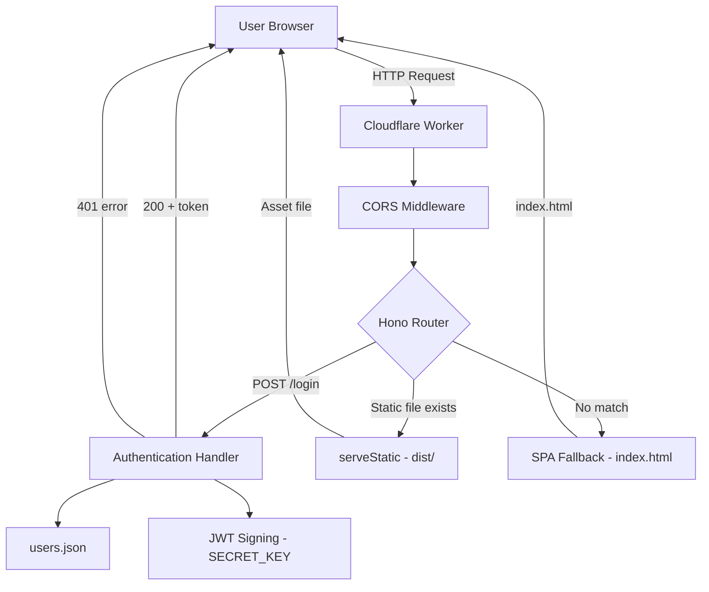

# Design Document: Worker Frontend Serving

## Overview

This design describes how the Cloudflare Worker acts as the single entry point for the TODO List application. The Worker handles two responsibilities: (1) serving the compiled Vue.js SPA as static assets, and (2) exposing a `/login` API endpoint for JWT-based authentication. The Hono framework provides the routing and middleware infrastructure, while Cloudflare's `[assets]` binding and `serveStatic()` handle static file delivery.

The architecture follows a "Worker as reverse proxy" pattern where all requests flow through Hono's middleware chain. API routes are matched first, then static assets, and finally an SPA fallback serves `index.html` for client-side routing.

## Architecture



### Request Flow

1. All requests enter the Worker via the single `fetch` handler exported by Hono.
2. The CORS middleware processes every request first, handling preflight OPTIONS and adding response headers.
3. Hono's router evaluates routes in registration order:
   - `POST /login` → authentication handler
   - `GET /*` → `serveStatic()` attempts to match a file in `dist/`
   - `notFound` handler → serves `index.html` as SPA fallback
4. Cloudflare's `[assets]` binding (configured in `wrangler.toml`) makes the `dist/` directory available to the Worker at the edge.

### Design Decisions

| Decision | Rationale |
|----------|-----------|
| Hono over raw Worker `fetch` | Hono provides ergonomic routing, middleware composition, and built-in JWT/CORS utilities while adding minimal overhead. |
| Route registration order: API → static → fallback | Ensures API requests are never accidentally caught by the static asset handler or SPA fallback. |
| `serveStatic()` with Cloudflare `[assets]` binding | Cloudflare handles asset caching and edge delivery; `serveStatic()` maps request paths to files in `dist/`. |
| `notFound` as SPA fallback | Any path that doesn't match an API route or existing static file gets `index.html`, allowing Vue Router to handle client-side navigation. |
| JWT with 2-hour expiration | Balances security (short-lived tokens) with usability (users don't re-authenticate constantly). |
| Vite `outDir: '../dist'` | Builds frontend assets directly into the Worker project root's `dist/` directory, matching the `[assets].directory` in `wrangler.toml`. |

## Components and Interfaces

### 1. CORS Middleware

**Purpose:** Allows the frontend dev server (`localhost:5173`) to call Worker API endpoints during development.

**Interface:**
```typescript
// Applied to all routes via app.use("/*", cors({...}))
cors({
  origin: "http://localhost:5173",
  allowHeaders: ["Content-Type", "Authorization"],
  allowMethods: ["POST", "GET", "OPTIONS"],
  exposeHeaders: ["Content-Length"],
  maxAge: 600,
  credentials: true,
})
```

**Behavior:**
- Adds `Access-Control-Allow-Origin` header to all responses.
- Responds to `OPTIONS` preflight requests with the full CORS header set.
- In production, the CORS origin could be restricted or removed since the frontend is served from the same origin.

### 2. Authentication Handler (`POST /login`)

**Purpose:** Validates user credentials against the User Store and issues a signed JWT.

**Interface:**
```typescript
// Request
POST /login
Content-Type: application/json
{ "username": string, "password": string }

// Success Response (200)
{ "token": string }

// Failure Response (401)
{ "error": "Invalid credentials" }
```

**Behavior:**
1. Parses the JSON request body to extract `username` and `password`.
2. Searches `users.json` for a matching record (exact match on both fields).
3. If no match → returns `401` with error JSON.
4. If match found → constructs JWT payload with `username` and `exp` (current time + 7200 seconds).
5. Signs the JWT using `SECRET_KEY` from the Worker's environment bindings.
6. Returns the signed token in a JSON response.

### 3. Static Asset Server

**Purpose:** Serves compiled frontend files (JS, CSS, HTML, images, fonts) from the `dist/` directory.

**Interface:**
```typescript
app.get("/*", serveStatic());
```

**Behavior:**
- Maps the request path directly to a file in `dist/`.
- Cloudflare's asset binding handles Content-Type detection and caching headers.
- If the file doesn't exist, the request falls through to the `notFound` handler.

### 4. SPA Fallback Handler

**Purpose:** Serves `index.html` for any request that doesn't match an API route or static asset, enabling Vue Router's client-side navigation.

**Interface:**
```typescript
app.notFound((c) => {
  return serveStatic({ path: "./index.html" })(c);
});
```

**Behavior:**
- Triggered only when no other route or static file matches.
- Always returns `index.html` with HTTP 200.
- Vue Router then inspects `window.location` and renders the appropriate view.

### 5. Build Pipeline

**Purpose:** Compiles the Vue.js frontend and outputs assets to the Worker's `dist/` directory.

**Interface:**
```bash
# Build frontend only
npm run build:frontend  # → cd frontend && npm run build

# Build and deploy
npm run deploy          # → npm run build:frontend && wrangler deploy
```

**Behavior:**
- Vite compiles the Vue.js app with tree-shaking, minification, and code-splitting.
- Output goes to `frontend/../dist` (the Worker project root's `dist/` directory).
- `wrangler deploy` uploads the Worker code and the `dist/` assets together.

## Data Models

### User Record (users.json)

```typescript
interface User {
  id: number;
  username: string;
  password: string;  // Plain text (development only)
  name: string;
  role: "admin" | "user";
}
```

The User Store is a static JSON array bundled with the Worker source code. It is imported directly in `index.ts`.

### JWT Payload

```typescript
interface JWTPayload {
  username: string;  // The authenticated user's username
  exp: number;       // Expiration timestamp (Unix seconds, issued time + 7200)
}
```

### Login Request Body

```typescript
interface LoginRequest {
  username: string;
  password: string;
}
```

### Login Response

```typescript
// Success
interface LoginSuccess {
  token: string;  // Signed JWT
}

// Failure
interface LoginError {
  error: string;  // "Invalid credentials"
}
```

## Correctness Properties

*A property is a characteristic or behavior that should hold true across all valid executions of a system — essentially, a formal statement about what the system should do. Properties serve as the bridge between human-readable specifications and machine-verifiable correctness guarantees.*

### Property 1: Valid credentials always produce a verifiable JWT

*For any* user record in the User Store, submitting that user's exact username and password to `POST /login` SHALL return a 200 response containing a JWT that, when decoded with the same `SECRET_KEY`, yields a payload with the correct `username` and a valid `exp` claim set to approximately 2 hours from issuance.

**Validates: Requirements 3.1, 3.3, 3.4**

### Property 2: Invalid credentials always produce 401

*For any* username/password combination that does not exactly match a record in the User Store, submitting it to `POST /login` SHALL return HTTP 401 with a JSON body containing an `error` field.

**Validates: Requirements 3.2**

### Property 3: API routes take precedence over static asset serving

*For any* request matching a registered API route (e.g., `POST /login`), the Worker SHALL process it as an API call and never serve static asset content, regardless of whether a file exists at that path in `dist/`.

**Validates: Requirements 4.1, 4.2**

### Property 4: Non-API, non-asset paths always receive index.html

*For any* GET request path that does not match a registered API route and does not correspond to an existing file in `dist/`, the Worker SHALL respond with the contents of `index.html` and HTTP status 200.

**Validates: Requirements 2.1, 2.2**

## Error Handling

| Scenario | Handling | Response |
|----------|----------|----------|
| Invalid JSON body on `POST /login` | Hono's `c.req.json()` throws | 400 Bad Request (Hono default error handler) |
| Missing username or password fields | Credential lookup returns `undefined` | 401 with `{ "error": "Invalid credentials" }` |
| Invalid credentials | No matching user found | 401 with `{ "error": "Invalid credentials" }` |
| Static asset not found | `serveStatic()` doesn't match | Falls through to `notFound` → serves `index.html` |
| `SECRET_KEY` not configured | `sign()` fails | 500 Internal Server Error (should be caught in deployment validation) |
| Malformed request (non-JSON Content-Type) | `c.req.json()` throws | 400 Bad Request |

### Error Design Principles

- **Fail closed on auth:** Any credential mismatch results in 401. No distinction between "user not found" and "wrong password" to prevent enumeration.
- **Graceful degradation on assets:** Missing assets don't produce 404 — they fall through to the SPA fallback. Only truly broken requests (malformed headers, server errors) produce error responses.
- **Environment validation:** The `SECRET_KEY` binding must be set via `wrangler secret put` or `.dev.vars`. A missing key causes JWT signing to fail at runtime.

## Testing Strategy

### Unit Tests

Unit tests verify specific behaviors with concrete examples:

- **Login success:** Submit known valid credentials, assert 200 + valid JWT structure.
- **Login failure:** Submit invalid credentials, assert 401 + error JSON.
- **JWT claims:** Verify issued token contains correct `username` and `exp` within expected range.
- **CORS headers:** Verify OPTIONS preflight returns correct headers for `localhost:5173`.
- **Route priority:** Verify `POST /login` is handled by the API handler even if a `login` file existed in `dist/`.

### Property-Based Tests

Property tests verify universal properties across generated inputs:

- **Library:** [fast-check](https://github.com/dubzzz/fast-check) (JavaScript/TypeScript PBT library)
- **Minimum iterations:** 100 per property
- **Tag format:** `Feature: worker-frontend-serving, Property {N}: {description}`

| Property | Generator Strategy |
|----------|-------------------|
| Property 1 (Valid credentials → JWT) | Generate random selections from the user store; verify JWT decode roundtrip |
| Property 2 (Invalid credentials → 401) | Generate arbitrary string pairs, filtering out those matching any store entry |
| Property 3 (API route priority) | Generate random HTTP methods and paths matching API routes |
| Property 4 (SPA fallback) | Generate random URL paths that don't match known static files or API routes |

### Integration Tests

- **Full request lifecycle:** Build frontend, start Worker locally with `wrangler dev`, submit login request, use returned JWT for a subsequent authenticated endpoint.
- **Static asset serving:** Verify that built assets (JS, CSS) are served with correct Content-Type headers.
- **SPA routing:** Request deep-link paths (`/tasks`, `/settings`) and verify `index.html` is returned.

### Build Validation

- **Vite output:** Verify `npm run build:frontend` produces files in the root `dist/` directory (not `frontend/dist`).
- **Deploy dry-run:** Verify `wrangler deploy --dry-run` packages both Worker code and assets without errors.
